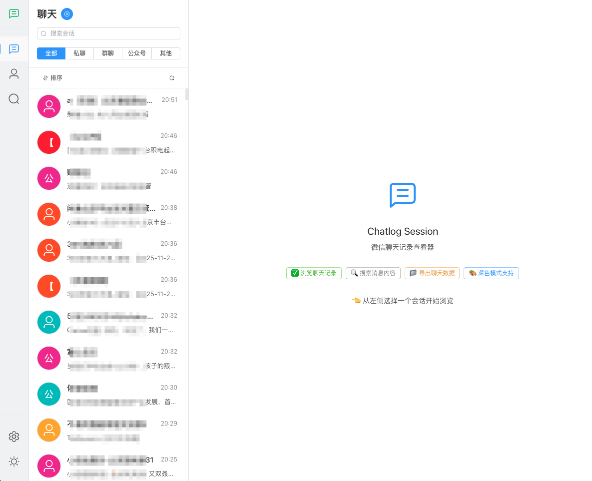
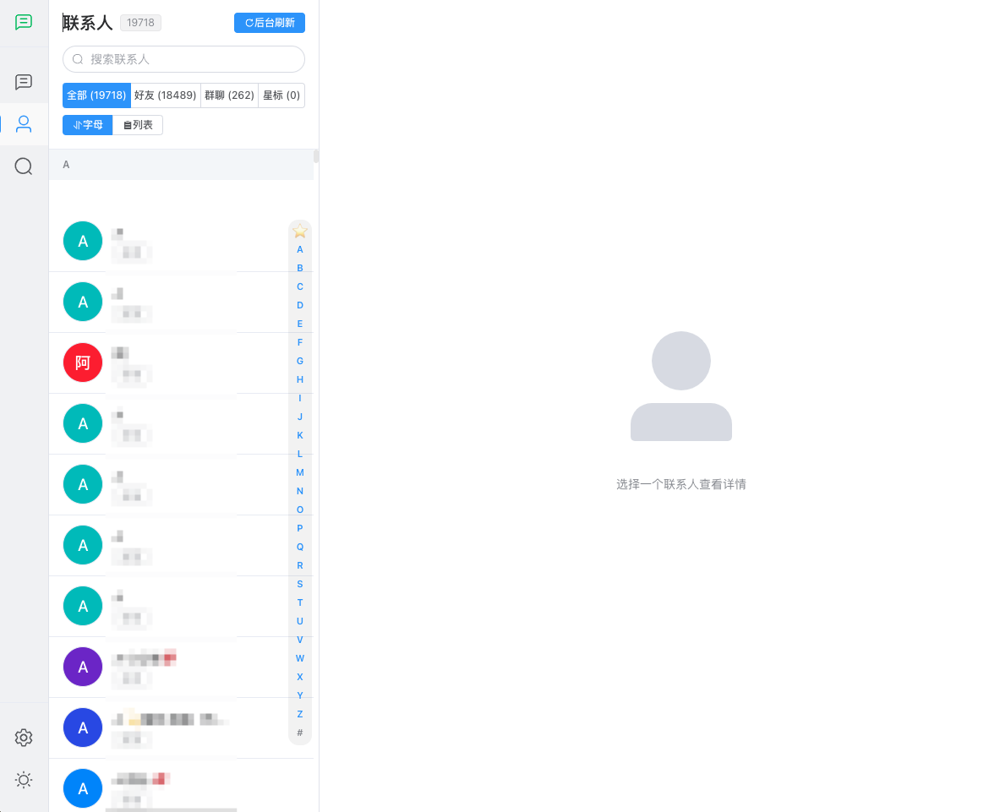

<div align="center">


# Chatlog Session

*基于 Chatlog API 的现代化微信聊天记录查看器*

[](LICENSE)
[](https://github.com/sjzar/chatlog)
[](https://vuejs.org/)
[](https://www.typescriptlang.org/)
[](https://web.dev/progressive-web-apps/)

一个现代化的 Web 应用，提供类似微信的界面来查看和管理您的聊天记录。  
专注于隐私保护、极致性能与流畅体验。

[在线演示](https://xlight.github.io/chatlog-session/) •
[功能特性](#-功能特性) •
[界面预览](#-界面预览) •
[快速开始](#-快速开始) •
[文档](#-文档)

</div>

---

## 📖 简介

**Chatlog Session** 是一个专为 [Chatlog](https://github.com/sjzar/chatlog) 设计的现代化前端客户端。它采用 Vue 3 + TypeScript + Vite 技术栈构建，旨在为您提供一个熟悉、流畅且功能强大的聊天记录管理界面。

### 🔒 核心承诺：100% 隐私保护

> **这是一个纯前端应用**。
> 
> 所有数据都在您的浏览器本地处理（IndexedDB）和展示，**绝对不会上传到任何第三方服务器**。您的聊天记录、联系人信息等敏感数据完全由您掌控。

## ✨ 功能特性

### 🆕 最新亮点 (v0.15.0)

-   📌 **本地会话置顶**：突破服务端限制，自由置顶重要会话，支持折叠分组。
-   📊 **全新仪表盘**：直观展示聊天统计数据，回顾您的社交足迹。
-   🎬 **Live Photo 支持**：直接在浏览器中预览和播放 Live Photo 及视频消息。
-   🔍 **智能筛选**：快速筛选“聊天”、“置顶”会话，查找更高效。

### 核心功能

-   🎨 **原生体验**：深度复刻微信 UI 设计，零学习成本，上手即用。
-   ⚡ **极致性能**：采用虚拟滚动技术，轻松应对十万级消息列表，流畅不卡顿。
-   📱 **PWA 支持**：可安装至桌面/手机主屏幕，支持离线访问，体验接近原生 App。
-   🔄 **实时同步**：自动同步最新消息，支持后台静默刷新。
-   📂 **多媒体支持**：完美支持文本、图片、视频、语音、表情、引用回复等多种消息类型。
-   🔎 **全局搜索**：支持搜索联系人、群聊及聊天记录内容。

## 📸 界面预览

<div align="center">
  <h3>📊 数据仪表盘</h3>
  <p>直观的统计视图，让数据不再枯燥</p>
  
</div>

<br>

<div align="center">
  <h3>💬 会话与联系人</h3>
  <p>熟悉的界面布局，流畅的操作体验</p>
  <table style="border: none;">
    <tr>
      <td align="center" style="border: none;">
        
        <br><b>会话列表</b>
      </td>
      <td width="20"></td>
      <td align="center" style="border: none;">
        
        <br><b>联系人列表</b>
      </td>
    </tr>
  </table>
</div>

<br>

<div align="center">
  <h3>🔍 全局搜索</h3>
  <p>快速定位人、群、聊天记录</p>
  
</div>

## 🚀 快速开始

### 方式 1: 在线体验（推荐）

直接访问 GitHub Pages 部署的最新版本，无需任何安装：

👉 **[https://xlight.github.io/chatlog-session/](https://xlight.github.io/chatlog-session/)**

**首次使用步骤：**
1. 打开上述链接。
2. 进入 **设置 (Settings) → API 设定**。
3. 输入您的 Chatlog API 地址（例如 `http://localhost:5030`）。
    ⚠️可能会由于浏览器安全策略，无法连接 API 地址，请使用 Chrome 并允许不安全内容，或将 API 部署为 HTTPS。
4. 点击 **测试连接** 确认成功，即可开始浏览。

### 方式 2: 本地部署

如果您希望完全在本地运行代码：

```bash
# 1. 克隆仓库
git clone https://github.com/xlight/chatlog-session.git
cd chatlog-session

# 2. 安装依赖
npm install

# 3. 启动开发服务器
npm run dev
# 访问 http://localhost:5173
```

## 🛠️ 技术栈

本项目基于以下优秀的开源技术构建：

| 类型 | 技术 | 说明 |
|------|------|------|
| **核心框架** | Vue 3 | 组合式 API, `<script setup>` |
| **语言** | TypeScript | 类型安全，开发体验极佳 |
| **构建工具** | Vite | 极速冷启动与热更新 |
| **状态管理** | Pinia | 直观、轻量的状态管理库 |
| **UI 组件** | Element Plus | 优雅的桌面端组件库 |
| **性能优化** | vue-virtual-scroller | 处理海量数据的虚拟滚动方案 |
| **本地存储** | IndexedDB (idb) | 浏览器端高性能大容量存储 |

## 🗺️ 路线图

### ✅ 已完成
- [x] **v0.15.0**: 本地会话置顶、Dashboard 重构、Live Photo 支持
- [x] **v0.14.0**: 聊天记录/转发消息增强、消息列表体验优化
- [x] **v0.13.0**: PWA 核心功能（Service Worker、Manifest）
- [x] **v0.12.0**: 通知优化、隐私设置增强
- [x] **v0.11.0**: 图片占位符、消息自动刷新与缓存

### 🔮 规划中
- [ ] **v0.16.0**: 数据导出增强
- [ ] **v0.17.0**: 滚动位置记忆、手势返回、下拉刷新
- [ ] **v1.0.0**: 正式版发布

> 详细路线图请参考 [ROADMAP.md](https://github.com/xlight/chatlog-session-docs/blob/main/ROADMAP.md)

## ❓ 常见问题

<details>
<summary><b>Q: 为什么我的图片无法显示？</b></summary>

1. 确保您的 Chatlog API 服务正常运行。
2. 检查 **设置** 中的 API 地址是否正确。
3. 由于 chatlog 需要 img_key 才能访问图片资源，请确保您的 API 服务已正确配置并能够提供 img_key。
4. 如果是在线版（HTTPS）连接本地 HTTP API，可能会遇到 Mixed Content 问题。建议使用 Chrome 浏览器并允许不安全内容，或将 API 部署为 HTTPS。
</details>

<details>
<summary><b>Q: 数据是存在哪里的？</b></summary>

所有数据仅存储在您的浏览器 **本地缓存** 中。当您清除浏览器缓存或卸载 PWA 应用时，这些数据会被清除。我们不会上传任何数据到云端。
</details>

更多问题请查看 [FAQ 文档](docs/user-guide/faq.md)。

## 📄 许可证

本项目采用 **Apache License 2.0** 许可证。详见 [LICENSE](LICENSE) 文件。

## 🙏 致谢

感谢以下项目为 Chatlog Session 提供的支持与灵感：

- [Chatlog](https://github.com/sjzar/chatlog) - 强大的后端 API 支持
- [Vue.js](https://vuejs.org/) & [Vite](https://vitejs.dev/) - 优秀的前端开发生态

## 📞 联系方式

- 📧 **提交 Issue** - 发现 Bug 或有功能建议？请通过 [GitHub Issues](https://github.com/xlight/chatlog-session/issues) 告诉我们
- 📖 **查阅文档** - 详细信息请参阅 [项目文档](docs/README.md)
- 🐧 **QQ 交流群** - 欢迎扫码加入 QQ 群，与其他用户和开发者互动

  <div align="center">
    
    <p><strong>QQ 群号: 1013023266</strong></p>
  </div>

## 🌟 Star History

如果这个项目对您有帮助，请给我们一个 ⭐️

[](https://star-history.com/#xlight/chatlog-session&Date)

---

<div align="center">

**Built with ❤️ by Chatlog Session Team**

[⬆ 返回顶部](#chatlog-session)

</div>
