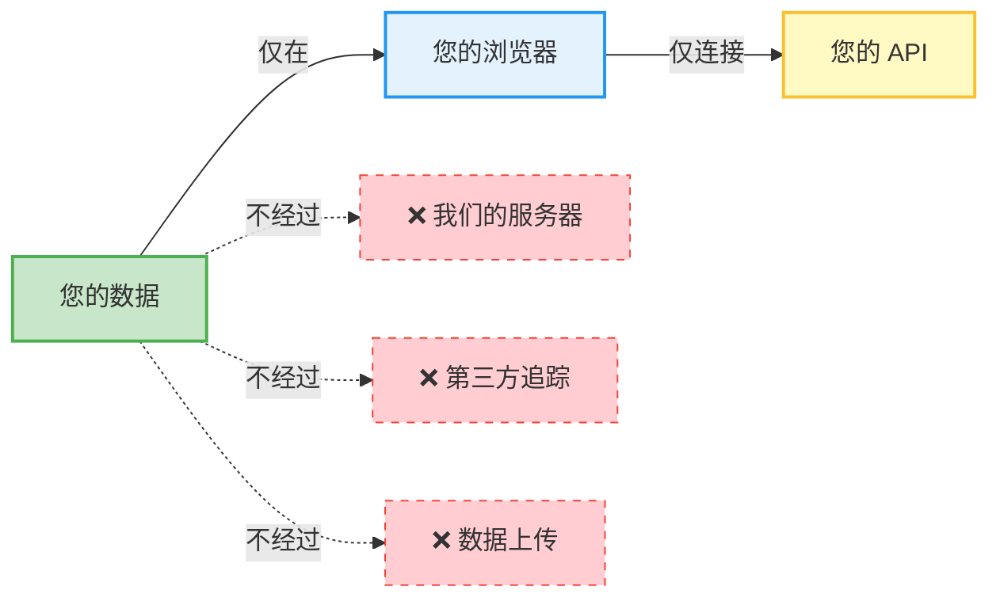
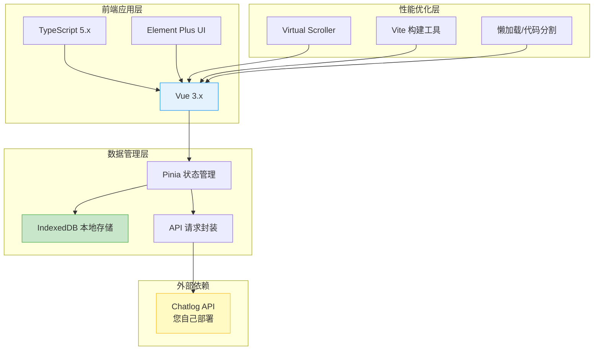
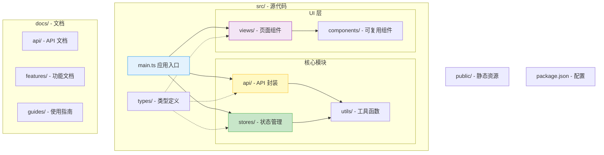
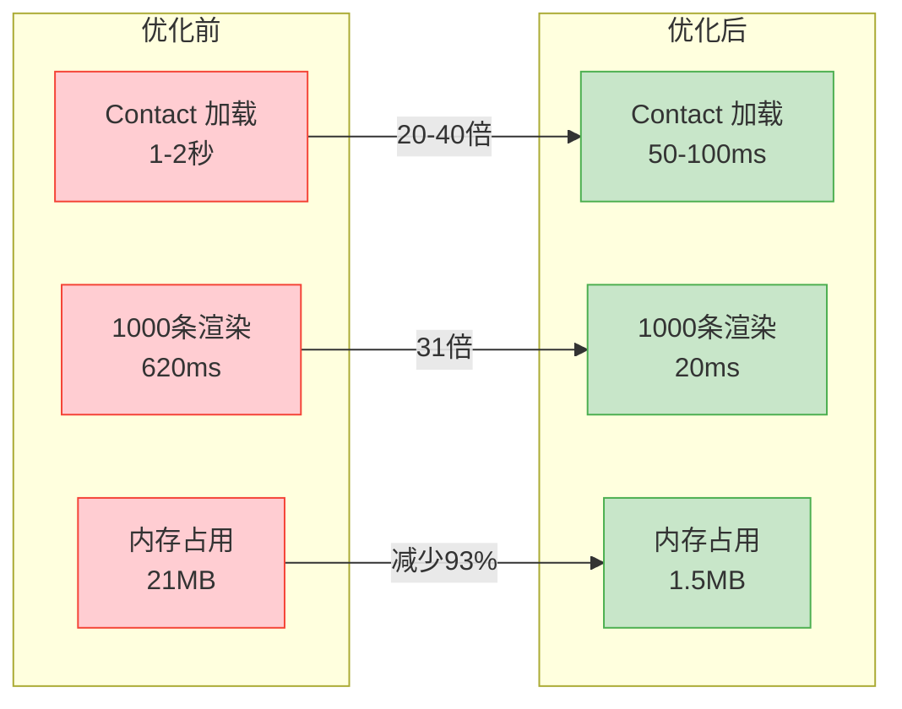
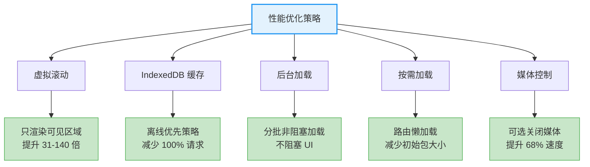
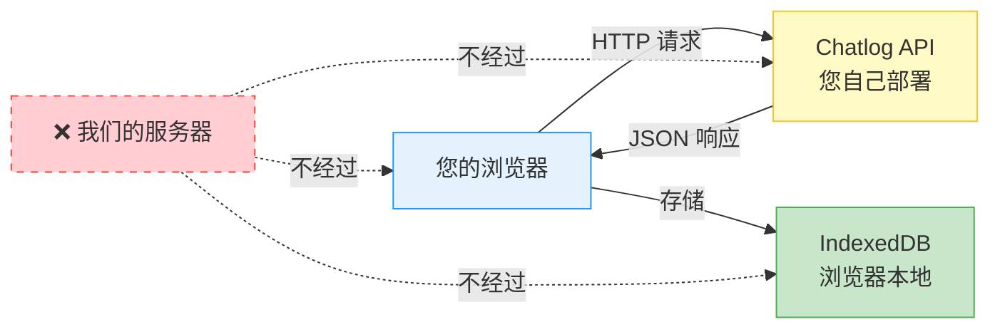
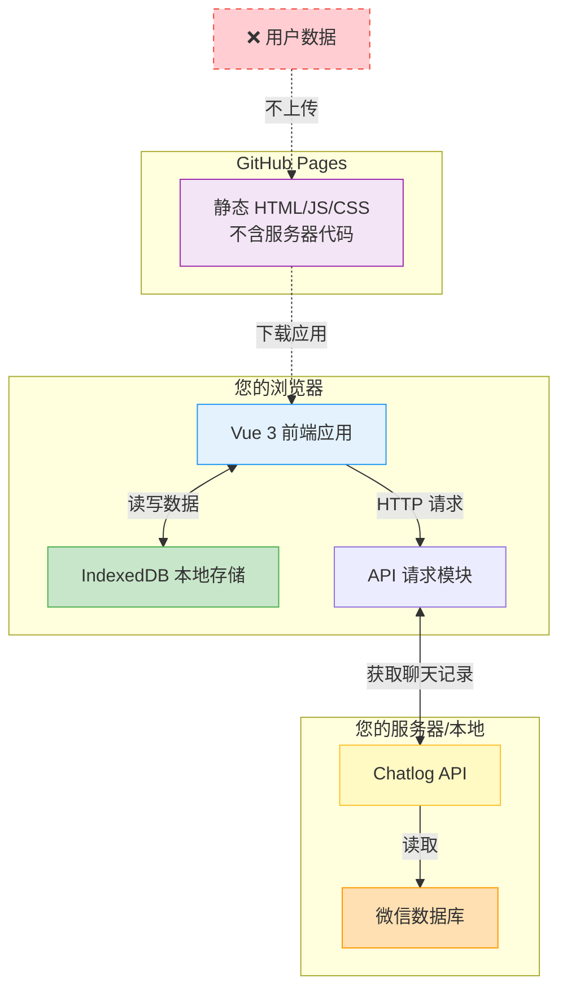

<div align="center">

# Chatlog Session

*基于 Chatlog API 的现代化微信聊天记录查看器*

[](LICENSE)
[](https://github.com/sjzar/chatlog)
[](https://vuejs.org/)
[](https://www.typescriptlang.org/)
[](docs/references/version-history.md)

一个现代化的 Web 应用，提供类似微信的界面来查看和管理您的聊天记录。

[在线演示](#-在线演示) •
[功能特性](#-功能特性) •
[快速开始](#-快速开始) •
[技术栈](#️-技术栈) •
[文档](#-文档) •
[贡献指南](#-贡献指南)

</div>

---

## 📖 简介

Chatlog Session 是一个基于 [Chatlog](https://github.com/sjzar/chatlog) API 的现代化前端应用，采用 Vue 3 + TypeScript + Vite 技术栈，为用户提供一个熟悉、流畅的聊天记录查看体验。

### 🔒 100% 隐私保护承诺



> **这是一个纯前端应用**，所有数据都在您的浏览器本地处理和存储，**不会上传到任何服务器**。  
> 您的聊天记录、联系人信息等敏感数据完全由您掌控，我们不收集、不存储、不传输任何用户数据。

### 为什么选择 Chatlog Session？

- 🔐 **隐私优先** - 纯前端应用，数据仅存储在浏览器本地，不上传服务器
- 🎨 **熟悉的界面** - 仿微信设计，零学习成本
- ⚡ **极致性能** - 虚拟滚动、IndexedDB 缓存，加载速度提升 20-40 倍
- 📡 **离线支持** - 支持离线浏览，无需网络也能查看历史记录
- 🔧 **灵活配置** - 可自定义 API 地址、超时、重试等参数
- 🎯 **用户友好** - 自动初始化、智能后台加载、实时进度反馈
- 🚫 **零追踪** - 不记录任何用户行为数据，不使用任何分析工具

## 🌐 在线演示

### 体验地址

您可以直接访问在线演示版本，无需本地安装：

**🔗 https://xlight.github.io/chatlog-session/**

### 首次使用

1. 进入 **设置 → API 设定**
2. 配置您的 Chatlog API 地址
3. 点击 **测试连接** 验证
4. 返回 **联系人** 视图，点击 **后台刷新** 加载数据

### 自动部署

本项目使用 GitHub Actions 自动构建和部署：

- ✅ 推送到 main 分支自动触发部署
- ✅ 构建产物自动发布到 GitHub Pages
- ✅ 支持手动触发部署
- ✅ 每次部署约 2-3 分钟完成

详见：[GitHub Pages 部署指南](docs/deployment/github-pages.md)

## ✨ 功能特性

### 核心功能

- 🔒 **本地隐私保护** - 纯前端应用，数据不上传服务器
- 💬 **聊天记录浏览** - 完整的聊天历史记录查看
- 🔍 **智能搜索** - 全局搜索和会话内搜索
- 👥 **联系人管理** - 好友、群聊、公众号管理
- 🖼️ **多媒体支持** - 图片、视频、语音、文件预览
- 📤 **消息导出** - 支持导出为 JSON/CSV/Text 格式
- 🎛️ **媒体显示控制** - 可关闭媒体资源显示，提升性能（v0.7.0 新增）

### 高级特性

- 🚀 **虚拟滚动** - 支持大量数据流畅渲染（提升 31-140 倍性能）
- 💾 **IndexedDB 缓存** - 本地数据持久化，瞬间加载
- 🔄 **后台刷新** - 智能后台加载，不阻塞界面
- 📊 **实时进度** - 加载进度条和速度显示
- 🎨 **主题切换** - 支持浅色/深色/跟随系统
- 🌐 **响应式设计** - 完美适配桌面和移动设备
- ⚡ **性能优化** - 关闭媒体显示后加载速度提升 68%（v0.7.0）

### 消息类型支持

- ✅ 文本消息（包含表情）
- ✅ 图片消息（支持 MD5 加载）
- ✅ 视频消息
- ✅ 语音消息
- ✅ 文件消息
- ✅ 链接分享
- ✅ 引用回复
- ✅ 转发消息包
- ✅ 位置信息
- ✅ 小程序卡片
- ✅ 可控制媒体显示（v0.7.0）

## 🏗️ 技术栈



| 类型 | 技术 | 版本 |
|------|------|------|
| **前端框架** | Vue.js | 3.x |
| **开发语言** | TypeScript | 5.x |
| **构建工具** | Vite | 5.x |
| **状态管理** | Pinia | 2.x |
| **UI 组件库** | Element Plus | 2.x |
| **虚拟滚动** | vue-virtual-scroller | next |
| **本地存储** | IndexedDB | - |
| **后端 API** | Chatlog | - |

## 🚀 快速开始

### 方式 1: 在线体验（推荐）

直接访问在线演示：https://xlight.github.io/chatlog-session/

无需安装，只需配置 API 地址即可使用。

### 方式 2: 本地部署

#### 前置要求

1. ✅ [Node.js](https://nodejs.org/) >= 16.0.0
2. ✅ [Chatlog](https://github.com/sjzar/chatlog) 已安装并运行

#### 安装步骤

```bash
# 克隆项目
git clone https://github.com/xlight/chatlog-session.git
cd chatlog-session

# 安装依赖
npm install

# 启动开发服务器
npm run dev
```

### 配置 API

#### 方式 1: 应用内设置（推荐）

1. 启动应用后，进入 **设置 → API 设定**
2. 输入 Chatlog API 地址（如 `http://localhost:8080`）
3. 点击 **测试连接** 验证
4. 点击 **保存设置**

详见：[API 设定快速指南](docs/guides/quick-start/api-settings-quick-guide.md)

#### 方式 2: 环境变量（开发环境）

创建 `.env.local` 文件：

```env
VITE_API_BASE_URL=http://127.0.0.1:5030
VITE_API_TIMEOUT=30000
VITE_ENABLE_DEBUG=true
```

#### 启动 Chatlog API

```bash
# 启动 Chatlog HTTP 服务
chatlog server --port 8080
```

## 📚 文档

### 📖 用户文档

- [用户使用手册](docs/guides/user/user-guide.md) - 完整的使用说明
- [后台刷新指南](docs/guides/user/background-refresh-guide.md) - 如何刷新联系人数据
- [API 设定指南](docs/guides/quick-start/api-settings-quick-guide.md) - 配置 API 连接

### 🚀 部署文档

- [GitHub Pages 部署](docs/deployment/github-pages.md) - 自动构建和发布到 GitHub Pages

### 💻 开发文档

- [开发者指南](docs/guides/developer/developer-guide.md) - 开发环境搭建
- [测试指南](docs/guides/developer/testing-guide.md) - 测试方法
- [调试指南](docs/guides/developer/debug-message-date.md) - 常见问题调试

### 🔌 API 文档

- [API 参考手册](docs/api/reference.md) - 完整的 API 接口文档
- [数据结构](docs/api/data-structure.md) - 数据模型说明
- [数据映射](docs/api/data-mapping.md) - 前后端数据转换
- [分页机制](docs/api/pagination.md) - 分页参数说明

### ⚡ 功能特性

- [后台刷新实现](docs/features/background-refresh-implementation.md) - 后台加载技术
- [Contact 数据库模式](docs/features/contact-db-mode.md) - 性能优化详解
- [虚拟滚动](docs/features/virtual-scroll.md) - 大数据渲染优化
- [API 设定](docs/features/api-settings.md) - API 配置功能
- [媒体资源显示控制](docs/features/media-display-control.md) - 媒体显示开关（v0.7.0）
- [下拉加载历史](docs/features/pull-down-to-load-history.md) - 历史消息加载（v0.6.0）

### 🏗️ 架构设计

- [主布局架构](docs/architecture/main-layout.md) - 应用布局设计
- [视图切换设计](docs/architecture/view-switching.md) - 视图切换机制
- [产品设计文档](docs/architecture/product-design.md) - 产品需求和设计

### 📝 更新日志

- [版本历史](docs/references/version-history.md) - 完整版本记录
- [v0.7.0](docs/changelog/CHANGELOG_v0.7.0.md) - 媒体资源显示控制（最新）
- [v0.6.0](docs/changelog/CHANGELOG_v0.6.0.md) - 下拉加载历史消息
- [v0.5.1](docs/changelog/CHANGELOG_v0.5.1.md) - 性能优化
- [v0.4.1](docs/changelog/CHANGELOG_v0.4.1.md) - API 设定增强
- [更多版本...](docs/changelog/)

## 🛠️ 开发指南

### 项目结构



```
chatlog-session/
├── src/
│   ├── api/              # API 接口封装
│   ├── components/       # Vue 组件
│   │   ├── chat/         # 聊天相关组件
│   │   └── common/       # 通用组件
│   ├── stores/           # Pinia 状态管理
│   ├── types/            # TypeScript 类型定义
│   ├── utils/            # 工具函数
│   │   ├── db.ts         # IndexedDB 封装
│   │   ├── request.ts    # HTTP 请求封装
│   │   └── background-loader.ts  # 后台加载器
│   ├── views/            # 页面组件
│   │   ├── Chat/         # 聊天视图
│   │   ├── Contact/      # 联系人视图
│   │   ├── Search/       # 搜索视图
│   │   └── Settings/     # 设置视图
│   └── main.ts           # 应用入口
├── docs/                 # 文档目录
│   ├── api/              # API 文档
│   ├── features/         # 功能特性文档
│   ├── architecture/     # 架构设计文档
│   ├── guides/           # 用户和开发指南
│   ├── changelog/        # 变更日志
│   └── README.md         # 文档索引
├── public/               # 静态资源
└── package.json          # 项目配置
```

### 开发命令

```bash
# 开发模式（带热重载）
npm run dev

# 类型检查
npm run type-check

# 代码检查和修复
npm run lint

# 生产构建
npm run build

# 预览生产构建
npm run preview
```

### 开发规范

- 遵循 [Vue 3 官方风格指南](https://vuejs.org/style-guide/)
- 使用 TypeScript 进行类型检查
- 使用 ESLint + Prettier 保持代码风格一致
- 组件使用 Composition API
- 文件名使用 kebab-case（小写 + 连字符）
- 提交信息遵循 [约定式提交](https://www.conventionalcommits.org/)

## 📊 性能优化

### 性能指标



| 功能 | 优化前 | 优化后 | 提升 |
|------|--------|--------|------|
| Contact 视图加载 | 1-2秒 | 50-100ms | **20-40倍** |
| 1000条数据渲染 | 620ms | 20ms | **31倍** |
| 5000条数据渲染 | 3500ms | 25ms | **140倍** |
| 内存占用（1000条） | 21MB | 1.5MB | **减少93%** |
| 网络请求（常规） | 每次访问 | 仅手动刷新 | **减少100%** |
| 关闭媒体后加载 | 2.5秒 | 0.8秒 | **68%提升** |
| 关闭媒体后请求 | 50个 | 10个 | **减少80%** |
| 关闭媒体后内存 | 150MB | 60MB | **减少60%** |

### 优化技术



- ✅ 虚拟滚动 - 只渲染可见区域
- ✅ IndexedDB 缓存 - 离线优先策略
- ✅ 后台加载 - 分批非阻塞加载
- ✅ 按需加载 - 路由懒加载
- ✅ 防抖节流 - 优化搜索和滚动
- ✅ 媒体显示控制 - 可选关闭媒体资源（v0.7.0）

## 🤝 贡献指南

我们欢迎所有形式的贡献！

### 如何贡献

1. 🍴 Fork 本仓库
2. 🌿 创建特性分支 (`git checkout -b feature/AmazingFeature`)
3. 💾 提交更改 (`git commit -m 'feat: add amazing feature'`)
4. 📤 推送到分支 (`git push origin feature/AmazingFeature`)
5. 🎉 提交 Pull Request

### 提交规范

使用语义化提交信息：

- `feat:` 新功能
- `fix:` 修复 bug
- `docs:` 文档更新
- `style:` 代码格式调整
- `refactor:` 代码重构
- `perf:` 性能优化
- `test:` 测试相关
- `chore:` 构建/工具相关

### 代码审查

所有 PR 需要通过：
- ✅ 代码风格检查（ESLint）
- ✅ 类型检查（TypeScript）
- ✅ 构建测试
- ✅ 至少一位维护者的审查

## 🚢 部署

### GitHub Pages

本项目已配置 GitHub Actions 自动部署到 GitHub Pages：

1. 推送代码到 `main` 分支
2. GitHub Actions 自动构建
3. 自动部署到 `https://<username>.github.io/chatlog-session/`

详见：[GitHub Pages 部署指南](docs/deployment/github-pages.md)

### 其他部署方式

- **Vercel**: 导入 GitHub 仓库即可自动部署
- **Netlify**: 拖拽 `dist` 目录或连接 Git 仓库
- **自托管**: 构建后将 `dist` 目录部署到任意静态服务器

## 📋 路线图

### ✅ 已完成

- [x] v0.7.0 - 媒体资源显示控制
- [x] v0.6.0 - 下拉加载历史消息
- [x] v0.5.0 - 虚拟滚动和性能优化
- [x] v0.4.0 - API 设定和后台刷新
- [x] v0.3.0 - IndexedDB 缓存
- [x] v0.2.0 - 基础聊天功能

### v0.8.0（计划中）

- [ ] 按类型单独控制媒体显示
- [ ] 智能检测加载失败，自动建议关闭
- [ ] 媒体预览模式（缩略图）
- [ ] 懒加载优化

### v0.9.0（计划中）

- [ ] 消息导出功能完善
- [ ] 移动端响应式优化
- [ ] 单元测试覆盖
- [ ] E2E 测试

### v1.0.0（目标：2025-Q2）

- [ ] 完整功能发布
- [ ] 生产环境部署方案
- [ ] 完整的用户文档
- [ ] 性能基准测试
- [ ] 多语言支持

## ❓ 常见问题

### Q: 如何配置 API 地址？

A: 进入 **设置 → API 设定**，输入 Chatlog API 地址并保存。详见 [API 设定指南](docs/guides/quick-start/api-settings-quick-guide.md)。

### Q: 无法连接到 Chatlog API

A: 请确认：
1. Chatlog 服务正在运行（`chatlog server`）
2. API 地址配置正确
3. 防火墙允许访问
4. 点击"测试连接"查看具体错误

### Q: 联系人列表为空

A: 首次使用需要加载联系人数据：
1. 进入 **联系人** 视图
2. 点击 **后台刷新** 按钮
3. 等待加载完成

或者打开 Chat 视图会自动检测并加载。

### Q: 图片无法显示

A: 请检查：
1. Chatlog 已正确解密数据库
2. 多媒体文件路径正确
3. 浏览器控制台错误信息
4. API 支持图片接口

### Q: 如何开启调试模式？

A: **设置 → API 设定 → 调试模式** 开启后，控制台会输出详细的 API 日志。

### Q: 如何关闭媒体资源显示？

A: **设置 → 聊天设置 → 显示媒体资源** 关闭后，图片、视频等媒体将显示为文本描述（如 `[图片]`）。适用于 Chatlog 无法获取附件密钥的情况。详见 [媒体显示控制文档](docs/features/media-display-control.md)。

### Q: 为什么要关闭媒体显示？

A: 当 Chatlog 服务无法获取附件解密密钥时，媒体无法正常显示。关闭媒体显示可以：
- 避免大量加载失败的占位符
- 提升页面加载速度（68%）
- 减少网络请求（80%）
- 获得纯文本阅读体验

### 更多问题

- 查看 [故障排查指南](docs/troubleshooting/TROUBLESHOOTING.md)
- 搜索 [已知问题](https://github.com/xlight/chatlog-session/issues)
- 提交 [新问题](https://github.com/xlight/chatlog-session/issues/new)

## 🔐 隐私与安全

### 隐私保护承诺

Chatlog Session 是一个**完全在本地运行的纯前端应用**，我们对您的隐私做出以下承诺：

#### ✅ 我们做到的

- **100% 本地处理** - 所有数据处理都在您的浏览器中进行
- **零数据上传** - 不会向任何服务器上传您的聊天记录、联系人信息或个人数据
- **本地存储** - 数据仅存储在浏览器的 IndexedDB 中，完全由您控制
- **无追踪分析** - 不使用 Google Analytics 或任何其他用户行为追踪工具
- **开源透明** - 所有源代码公开，欢迎审计和验证

#### 🔒 数据流向



**关键点**：数据只在您的设备和您自己部署的 Chatlog API 之间流动，**不经过我们的任何服务器**。

#### 🛡️ 安全建议

1. **使用本地部署** - 推荐将 Chatlog API 部署在本地或私有网络中
2. **HTTPS 连接** - 生产环境建议使用 HTTPS 加密连接
3. **定期清理** - 可在浏览器中手动清除 IndexedDB 数据
4. **访问控制** - 为 Chatlog API 设置访问密码（如支持）

#### 📊 技术实现



**技术保障**：
- **前端渲染** - 所有 UI 和数据处理在浏览器完成
- **无后端服务** - 静态文件部署，无服务器端代码
- **本地缓存** - 使用浏览器 IndexedDB 存储，不依赖远程数据库
- **开源审计** - 代码公开在 GitHub，可自行审查和验证

---

## ⚠️ 免责声明

本项目仅供学习、研究和个人合法使用。

### 使用须知

- ✅ 仅处理您自己合法拥有的聊天数据
- ✅ 遵守相关法律法规和隐私政策
- ✅ 尊重他人隐私权
- ✅ 自行部署 Chatlog API，确保数据安全
- ❌ 严禁用于未经授权访问他人数据
- ❌ 禁止用于任何非法目的
- ❌ 不得用于侵犯他人隐私

### 责任声明

使用本项目即表示您已阅读、理解并同意遵守上述条款。开发者不对使用本工具可能导致的任何损失、数据泄露或法律纠纷承担责任。虽然我们承诺不收集您的数据，但您需要自行确保 Chatlog API 的安全性和合法性。

## 📄 许可证

本项目基于 [Apache-2.0 许可证](LICENSE) 开源。

```
Copyright 2025 Chatlog Session Team

Licensed under the Apache License, Version 2.0 (the "License");
you may not use this file except in compliance with the License.
You may obtain a copy of the License at

    http://www.apache.org/licenses/LICENSE-2.0

Unless required by applicable law or agreed to in writing, software
distributed under the License is distributed on an "AS IS" BASIS,
WITHOUT WARRANTIES OR CONDITIONS OF ANY KIND, either express or implied.
See the License for the specific language governing permissions and
limitations under the License.
```

## 🙏 致谢

### 项目依赖

- [Chatlog](https://github.com/sjzar/chatlog) - 强大的后端 API 支持
- [Vue.js](https://vuejs.org/) - 渐进式 JavaScript 框架
- [Element Plus](https://element-plus.org/) - Vue 3 组件库
- [Vite](https://vitejs.dev/) - 下一代前端构建工具
- [Pinia](https://pinia.vuejs.org/) - Vue 状态管理库

### 贡献者

感谢所有为本项目做出贡献的开发者！

<!-- 如果有贡献者列表可以在这里添加 -->

## 📞 联系方式

- 📧 提交 Issue: [GitHub Issues](https://github.com/xlight/chatlog-session/issues)
- 💬 讨论交流: [GitHub Discussions](https://github.com/xlight/chatlog-session/discussions)
- 📖 完整文档: [docs/README.md](docs/README.md)

## 🌟 Star History

如果这个项目对您有帮助，请给我们一个 ⭐️

[](https://star-history.com/#xlight/chatlog-session&Date)

---

<div align="center">

**Built with ❤️ by Chatlog Session Team**

**当前版本**: [v0.7.0](docs/references/version-history.md) | **开发进度**: 90% | **发布日期**: 2025-01-XX

[⬆ 返回顶部](#chatlog-session)

</div>
